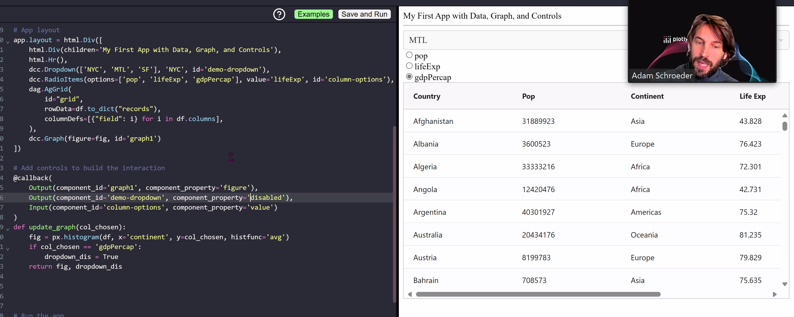

Met this guy, very smart

THE CALLBACK refresher
* Every callback decorator will have inputs and outputs, with component ID and property of said components
* Component properties are versatile, it is not only "value" you can put in there, you can impact any property. It is pretty powerful (e.g. the `disabled` property, which is a boolean data type) See an example use case although it does not make sense: 
* It is important to know the data type of the property you're using. E.g. here we're returning a list 
* 